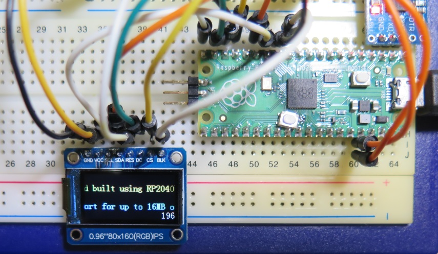
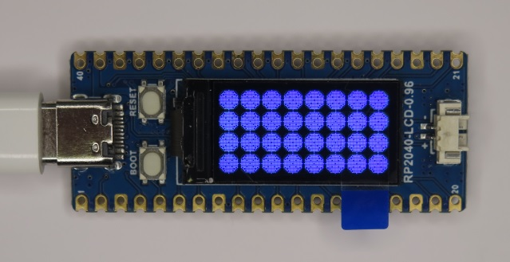
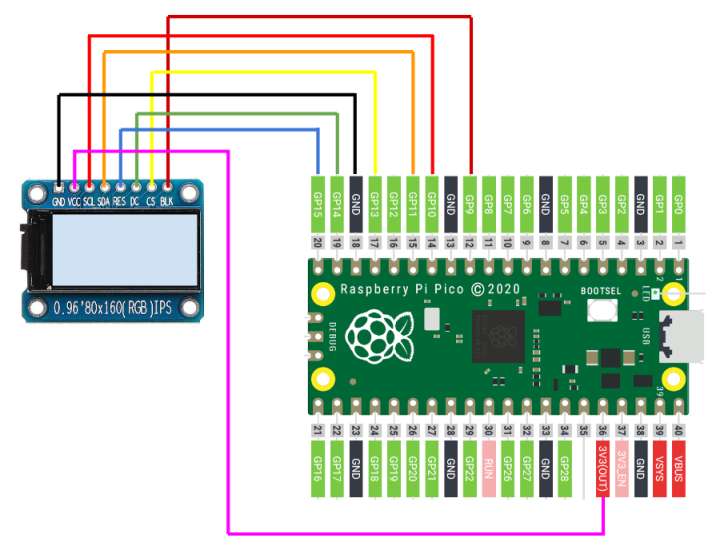

# Raspberry Pi Pico ST7735 80x160 LCD Library

## Overview
ST7735 80x160 LCD display library for Raspberry Pi Pico

This project supports:
* ST7735 80x160 LCD
* Backlight control by PWM

## Supported Board
* Raspberry Pi Pico
* ST7735S 80x160 LCD
* Waveshare RP2040-LCD-0.96 Board (ST7735S 80x160 LCD build-in)

## Pin Assignment
### ST7735S 80x160 LCD (Raspberry Pi Pico Board)

| Pico Pin # | Pin Name | Function | ST7735S 80x160 Board |
----|----|----|----
|12 | GP9 | GPIO | BLK |
|14 | GP10 | SPI1_SCK | SCL |
|15 | GP11 | SPI1_TX | SDA |
|17 | GP13 | SPI1_CSn | CS |
|19 | GP14 | GPIO | DC |
|20 | GP15 | GPIO | RES |
| 18 | GND | GND | GND |
| 36 | 3V3(OUT) | 3.3V | VCC |



### ST7735S 80x160 LCD (Waveshare RP2040-LCD-0.96 Board)

Uncomment #define BOARD_WAVESHARE_RP2040_LCD_096 in lcd.h

| Pin # | Pin Name | Function | Signal Name |
----|----|----|----
|11 | GP8 | GPIO | DC |
|12 | GP9 | SPI1_CSn | CS |
|14 | GP10 | SPI1_SCK | SCL |
|15 | GP11 | SPI1_TX | DIN |
|16 | GP12 | GPIO | RST |
|-- | GP25 | GPIO | BL |

### Serial (CP2102 module)
| Pico Pin # | Pin Name | Function | CP2102 module |
----|----|----|----
|  1 | GP0 | UART0_TX | RXD |
|  2 | GP1 | UART0_RX | TXD |
|  3 | GND | GND | GND |

## How to build
* See ["Getting started with Raspberry Pi Pico"](https://datasheets.raspberrypi.org/pico/getting-started-with-pico.pdf)
* Put "pico-sdk", "pico-examples" and "pico-extras" on the same level with this project folder.
* Set environmental variables for PICO_SDK_PATH, PICO_EXTRAS_PATH and PICO_EXAMPLES_PATH
* Confirmed with Pico SDK 2.0.0
```
> git clone -b 2.0.0 https://github.com/raspberrypi/pico-sdk.git
> cd pico-sdk
> git submodule update -i
> cd ..
> git clone -b sdk-2.0.0 https://github.com/raspberrypi/pico-examples.git
>
> git clone -b sdk-2.0.0 https://github.com/raspberrypi/pico-extras.git
>
> git clone -b main https://github.com/elehobica/pico_st7735_80x160.git
```
### Windows
* Build is confirmed with Developer Command Prompt for VS 2022 and Visual Studio Code on Windows environment
* Confirmed with cmake-3.27.2-windows-x86_64 and gcc-arm-none-eabi-10.3-2021.10-win32
* Lanuch "Developer Command Prompt for VS 2022"
```
> cd pico_st7735_80x160\test
> mkdir build && cd build
> cmake -G "NMake Makefiles" ..
> nmake
```
* Put "pico_st7735_80x160.uf2" on RPI-RP2 drive
### Linux
* Build is confirmed with [pico-sdk-dev-docker:sdk-2.0.0-1.0.0]( https://hub.docker.com/r/elehobica/pico-sdk-dev-docker)
* Confirmed with cmake-3.22.1 and arm-none-eabi-gcc (15:10.3-2021.07-4) 10.3.1
```
$ cd pico_st7735_80x160/test
$ mkdir build && cd build
$ cmake ..
$ make -j4
```
* Download "pico_st7735_80x160.uf2" on RPI-RP2 drive

## Configuration
Configure library settings by `LCD_Config()` with `pico_st7735_80x160_config_t`

```
pico_st7735_80x160_config_t lcd_cfg = {
    SPI_CLK_FREQ_DEFAULT,
    spi1,
    PIN_LCD_SPI1_CS_DEFAULT,
    PIN_LCD_SPI1_SCK_DEFAULT,
    PIN_LCD_SPI1_MOSI_DEFAULT,
    PIN_LCD_DC_DEFAULT,
    PIN_LCD_RST_DEFAULT,
    PIN_LCD_BLK_DEFAULT,
    INVERSION_DEFAULT,  // 0: non-color-inversion, 1: color-inversion
    RGB_ORDER_DEFAULT,  // 0: RGB, 1: BGR
    ROTATION_DEFAULT,
    H_OFS_DEFAULT,
    V_OFS_DEFAULT,
    X_MIRROR_DEFAULT
};
LCD_Config(&lcd_cfg);
```

## Backlight Control from Serial Terminal
When scrolling text display appears at demo final, program accepts Serial Terminal control.
* '+' to increase backlight level
* '-' to decrease backlight level
* 'r' to repeat demo

## Application Example
* [RPi_Pico_WAV_Player](https://github.com/elehobica/RPi_Pico_WAV_Player)
