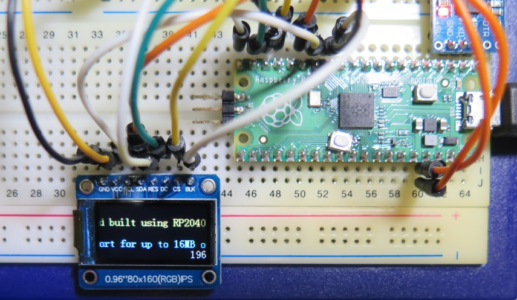

# Raspberry Pi Pico ST7735 80x160 LCD Test

## Overview
This project is LCD display demo for ST7735 80x160.

This project supports:
* ST7735 80x160 LCD Demo
* Backlight Control by PWM

## Supported Board
* Raspberry Pi Pico
* ST7735S 80x160 LCD

## Pin Assignment
### ST7735S 80x160 LCD

| Pico Pin # | Pin Name | Function | ST7735S 80x160 Board |
----|----|----|----
|12 | GP9 | GPIO | BLK |
|14 | GP10 | SPI1_SCK | SCL |
|15 | GP11 | SPI1_TX | SDA |
|17 | GP13 | SPI1_CSn | CS |
|19 | GP14 | GPIO | DC |
|20 | GP15 | GPIO | RES |
| 18 | GND | GND | GND |
| 36 | 3V3(OUT) | 3.3V | VCC |

### Serial (CP2102 module)
| Pico Pin # | Pin Name | Function | CP2102 module |
----|----|----|----
|  1 | GP0 | UART0_TX | RXD |
|  2 | GP1 | UART0_RX | TXD |
|  3 | GND | GND | GND |

## How to build
* See ["Getting started with Raspberry Pi Pico"](https://datasheets.raspberrypi.org/pico/getting-started-with-pico.pdf)
* Build is confirmed only in Developer Command Prompt for VS 2019 and Visual Studio Code on Windows enviroment
* Put "pico-sdk" and "pico-examples" on the same level with this project folder.
```
> git clone -b master https://github.com/raspberrypi/pico-sdk.git
> cd pico-sdk
> git submodule update -i
> cd ..
> git clone -b master https://github.com/raspberrypi/pico-examples.git
> 
> git clone -b main https://github.com/elehobica/pico_st7735_80x160.git
```
* Lanuch "Developer Command Prompt for VS 2019"
```
> cd pico_st7735_80x160
> mkdir build
> cd build
> cmake -G "NMake Makefiles" ..
> nmake
```
* Put "pico_st7735_80x160.uf2" on RPI-RP2 drive

## Backlight Control from Serial Terminal
When scrolling text display appears at demo final, program accepts Serial Terminal control.
* '+' to increase backlight level
* '-' to decrease backlight level
* 'r' to repeat demo
